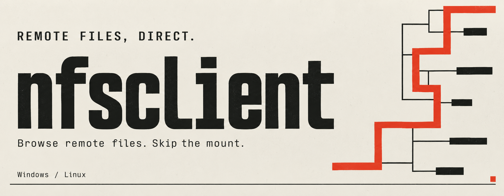
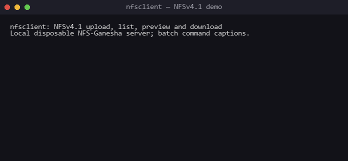

# nfsclient



An interactive NFS client for Windows and Linux. It connects directly through
RPC without an OS NFS client or mount. Ordinary operations support NFSv3 and
NFSv4.0/4.1/4.2 over TCP, plus bounded NFSv2 and v2/v3 UDP profiles.

The Go executable is CGO-free, including the opt-in FAST and PKINIT profiles
on Windows and Linux. See [authentication](docs/AUTHENTICATION.md) for their
explicit credential and server requirements.

See [documentation](docs/INDEX.md), [current compatibility](docs/COMPATIBILITY.md)
and the [client implementation plan](docs/PLAN.md). Detailed operation contracts are organized
by topic. See [contributing](CONTRIBUTING.md) and the [security policy](SECURITY.md).

Licensed under [MIT](LICENSE). Adapted GSS/Kerberos components retain their
original notices; binary distributions also include third-party licenses.



[Watch the full 2:13 video](docs/assets/demo.mp4) with seeking, or
[download the asciinema recording](docs/assets/demo.cast) for a full-resolution
replay (`asciinema play docs/assets/demo.cast`). Recorded from the real Windows
interactive v0.2.0 client against a disposable local NFS-Ganesha export. The
extended walkthrough covers help, navigation and Tab completion, text/hex
previews, corporate/cloud filename hints and `legend PATH`, upload/download,
symbolic and hard links, permissions, moves and cleanup. Commands are typed
automatically, including real Tab completion; the original `.cast` preserves
captured terminal output and timing. Local paths and private identifiers are
excluded, and downloaded bytes were verified. See
[recording instructions](tests/README.md#recording-the-readme-demo).

Video chapters: **0:00** connection/help, **0:08** navigation/previews,
**0:20** corporate/cloud hints, **0:47** transfers, **1:09** links/permissions,
**1:38** moves/cleanup.

## Install

Download [v0.2.0](https://github.com/durck/nfsclient/releases/tag/v0.2.0)
for your platform, or [build from source](#build-and-start).

| Platform | Direct executable | Bundle with licenses |
| --- | --- | --- |
| Windows x64 | [nfsclient-windows-amd64.exe](https://github.com/durck/nfsclient/releases/download/v0.2.0/nfsclient-windows-amd64.exe) | [ZIP](https://github.com/durck/nfsclient/releases/download/v0.2.0/nfsclient-v0.2.0-windows-amd64.zip) |
| Linux x64 | [nfsclient-linux-amd64](https://github.com/durck/nfsclient/releases/download/v0.2.0/nfsclient-linux-amd64) | [tar.gz](https://github.com/durck/nfsclient/releases/download/v0.2.0/nfsclient-v0.2.0-linux-amd64.tar.gz) |

Download a standalone executable or extract a bundle. The release includes
`LICENSE` and `THIRD-PARTY-LICENSES.txt` separately and inside both bundles.
Compare your download's SHA-256 digest with its entry in the release's
[SHA256SUMS](https://github.com/durck/nfsclient/releases/download/v0.2.0/SHA256SUMS).
Bundle-local checksums cover the extracted files; release checksums cover
the direct executables, archives and license files.

```powershell
Get-FileHash .\nfsclient-windows-amd64.exe -Algorithm SHA256
.\nfsclient-windows-amd64.exe --help
```

```sh
sha256sum nfsclient-linux-amd64  # Compare with the matching SHA256SUMS entry.
chmod +x nfsclient-linux-amd64
./nfsclient-linux-amd64 --help
```

A checksum detects corrupted downloads; it is not a publisher signature.

Development builds are also available from successful runs in
[GitHub Actions → CI](https://github.com/durck/nfsclient/actions/workflows/ci.yml).
Under **Artifacts**, select `nfsclient-Windows-amd64` or `nfsclient-Linux-amd64`;
`checks-*` contains verification logs. CI artifacts expire after 14 days.

## Build and start

Go 1.26 is required; `go.mod` selects patched Go 1.26.8 automatically.

Clone the repository and run the build commands from its directory:

```sh
git clone https://github.com/durck/nfsclient.git
cd nfsclient
```

```powershell
$previousCGOEnabled = $env:CGO_ENABLED
try {
  $env:CGO_ENABLED = "0"
  go build -trimpath -o bin/nfsclient-windows-amd64.exe .
} finally {
  $env:CGO_ENABLED = $previousCGOEnabled
}
.\bin\nfsclient-windows-amd64.exe nfs.example.test --export /data
```

```sh
CGO_ENABLED=0 go build -trimpath -o bin/nfsclient-linux-amd64 .
./bin/nfsclient-linux-amd64 nfs.example.test --export /data
```

Launching without arguments displays help. By default, AUTH_SYS/TCP probes
4.2, 4.1, 4.0, 3 and 2. Select `--nfs-version` explicitly to require a version.
NFSv4 uses the server's pseudo-root; v2/v3 use export discovery/MOUNT.

Before redistributing binaries, run `python -B tests/package_licenses.py` and
include the root `LICENSE` and generated `bin/THIRD-PARTY-LICENSES.txt`. It includes all modules
linked into either platform, the Go runtime and local GSS/Kerberos adaptations.
The self-check generates this file automatically.

## Everyday use

```text
exports
use /data
info
capabilities .
ls
cd documents
stat notes.txt
access notes.txt
cat notes.txt
get notes.txt local-notes.txt
put "local report.txt" "new report.txt"
chmod 640 "new report.txt"
ln notes.txt notes-copy.txt
ln -s notes.txt latest.txt
readlink latest.txt
handle notes.txt --json
id
exit
```

`ln` creates an exact new name without replacing existing entries (NFSv3/v4).
Hard-link sources must be regular files; `ln -s` stores its target literally,
including missing targets. Use `ln [-s] -- SOURCE DESTINATION` for names starting
with `-`. `readlink` displays the stored target with terminal controls escaped.
`chown OWNER[:GROUP] PATH` and `chgrp GROUP PATH` change ownership and verify it:
v2/v3 require numeric IDs; v4 sends exact server-recognized owner/group strings.
They reject final symlinks and trailing slashes except for `/`. Mutations keep
the current identity, require held locks to be released, and do not automatically retry an
uncertain result. See [ownership semantics](docs/REPLACEMENT.md#explicit-ownership-changes).

`info` includes the requested host, actual NFS/MOUNT peers and identity.
`mounts [--json]` reads legacy MOUNT records with a five-second/4096-entry bound;
records may be stale or incomplete and do not prove active clients. NFSv4 returns
unavailable without contacting mountd. `handle [PATH] [--json]` exports the
opaque handle as hex with connection context; it does not follow the final
symlink or accept trailing slashes except for `/`. This is diagnostic output,
not a restorable session or an import format. Handles can become stale.

The interactive prompt shows the current server name and connected IP, followed
by the remote directory: `nfs nas.example.test (192.0.2.10) /documents >`.
For an IP target, a best-effort reverse DNS lookup uses the selected DNS settings
and a 250 ms deadline. If no name is available, only the IP is shown. The display
is cached per connection and refreshed after reconnect or server changes.

Remote paths use `/`; relative paths and symlinks are interpreted within the
selected root. Commands do not invoke a local shell or expand wildcards and
environment variables. Quote names containing spaces. Tab completes commands,
help topics, options, supported values and local/remote paths, including quoted
paths. Remote suggestions use the current identity with a two-second deadline;
completion never switches UID or probes for another root. Optional `--history
FILE` persists history, otherwise it stays in memory.

### Help and completion

The default help is a short overview. Open the relevant topic or command for
its complete syntax; existing option names remain supported.

```text
nfsclient --help
nfsclient help auth
nfsclient help tls
nfsclient --help-all
nfsclient help scan
nfsclient help shell gettree
```

Inside the client, use `help`, `help transfer`, `help gettree`, or `gettree --help`.
`help all` prints the full shell reference. Standalone `COMMAND -h` also works.
The same reference is available before connecting via `nfsclient help shell`.
Tree-transfer options may precede or follow paths. For `ls`, `stat`, inspection
and tree-transfer commands, `--` ends options so a filename such as `--offline`
can be used literally. Other commands show their required option positions in
their individual help.

Interactive Tab completion works immediately. For operating-system shell
completion, install the executable as `nfsclient.exe` on Windows or `nfsclient`
on Linux: generated scripts register that command name. Generate its script
with `nfsclient completion bash`, `zsh`, `fish` or `powershell`. See
`nfsclient completion SHELL --help` for installation instructions. For the
current PowerShell session:

```powershell
.\nfsclient.exe completion powershell | Out-String | Invoke-Expression
```

Listings escape control characters and show link targets. `cat` validates a
bounded UTF-8 preview before printing to a terminal; redirected output retains
raw bytes. `hex` provides a bounded binary preview. `lls`, `lpwd` and `lcd` operate
on local files. `legend` explains colors; `--color=never` or `NO_COLOR` disables them.

Remote and local listings use the same palette. Directories are warm yellow,
configuration names blue, credential-related names pink, and data/backup names
lavender. Familiar system and boilerplate names are pale gray: for example,
`Windows`, `ProgramData`, `Program Files`, `System Volume Information`,
`desktop.ini`, `Thumbs.db`, and `README.md`. These are case-insensitive exact
basename hints, not an assessment of contents or safety; directory children
keep their own colors. **Modification dates in the current local calendar year
are always orange**, including gray entries and links with unavailable targets.
Link status labels distinguish missing/looping targets (red), denied/unverified
targets (amber), and unchecked targets (gray). Active transfers are turquoise,
successful completion green, and failures red; status text remains available
without color.

The listing's `OWNER` column omits the local placeholder suffixes `@localhost`
and `@localdomain` from owner/group names (for example, `root:root`). Other
domains remain visible; `stat` JSON retains the exact server-provided values.

Hints cover on-premises infrastructure as well as cloud tooling:

- AD/Samba identity stores, GPP files under `Preferences`, Windows deployment
  files, IIS/Java service configuration, Oracle wallets and DB connection profiles.
- Jenkins keys, network configurations, administrative scripts, command history,
  mail archives, database/1C dumps, virtual disks and backup formats.
- AWS, Docker, Kubernetes, Azure, Google Cloud and Terraform configuration/state.

Known paths refine ambiguous names: `.docker/config.json` gets a credential hint,
while an ordinary `config.json` remains a data file. Matching uses the known
listing/export path without extra network probes; it cannot identify paths above
an export or infer a server's real storage layout. Directory hints do not propagate
to children. Repeated backup/archive suffixes preserve the underlying hint
(`id_rsa.bak.old`, `credentials.xml.tar.gz`); explicit `.example`, `.sample`,
`.template`, `.dist` and `.default` suffixes receive a configuration hint.
Use `legend PATH` to explain one remote entry, including with color disabled.
These are name/path hints, never confirmation that credentials exist or are valid.

Transfers display progress on stderr, with `--progress=auto|always|never`.
Completion includes stable writes or local sync/publication. Interactive
collisions offer overwrite where supported, rename or cancel; batch commands
refuse collisions. Press Ctrl+C twice consecutively to exit the shell; the
first press cancels the current operation. `reconnect` restores a closed connection.

### Resource discovery

`exports` checks advertised MOUNT exports on NFSv2/v3 and explores the visible
server namespace on NFSv4, without requiring rpcbind or mountd for NFSv4.
It reports paths, discovery source, the current identity, directory listing and
traversal permissions, filesystem boundaries, and per-path failures.

```text
exports
exports --recursive --depth 5 --max-entries 5000 --discovery-timeout 20s
exports --json
exports --path /backup --path /home/team
exports --paths-file paths.txt
```

The default NFSv4 depth is 1; `--recursive` selects 3 unless `--depth` is given.
Repeated `--path` checks known absolute server paths before enumeration, even
when a parent denies listing. Explicit paths are independent of traversal depth
but share the time/entry budget and are limited to 64 components. NFSv2/v3 use
the longest advertised ancestor export or try the supplied path as a MOUNT root;
a hidden mount root cannot be inferred from an arbitrary file path.
`--paths-file` adds paths from a local UTF-8 file,
one absolute server path per line. An initial UTF-8 BOM and CRLF are accepted;
surrounding whitespace, blank lines and full-line `#` comments are ignored.
Relative filenames in the shell use the directory selected by `lcd`. File paths
and repeated `--path` values share `--max-entries`; duplicate lines count too.
Files are limited to 16 MiB, raw lines to less than 64 KiB and paths to 4096 bytes.
Invalid input rejects the whole list before discovery; no partial list is used.
Discovery defaults to 1000 examined entries (files count too) and 10 seconds.
Depth is limited to 64 and the entry budget to 100000. Legacy temporary MOUNT
registrations get up to 2 additional seconds for cleanup. Existing mounts,
UID/GID, security flavor, selected export and working directory are preserved.
Cancellation during an RPC can close that connection; use `reconnect` if needed.

Denied paths, required security changes, referrals, and depth/time/entry limits
produce partial results. Referrals are reported without following another server.
Symlinks are not followed. NFSv2 lacks ACCESS, so permissions remain unknown.
JSON retains `source` and adds merged `sources`, security/referral markers and
advertised SECINFO modes where available; no authentication fallback is attempted.
`listed_entries` and `listing_complete` add actual NFSv4 READDIR evidence:
zero entries means an empty directory only when listing completed. Absent fields
mean no enumeration; a partial zero-entry result does not prove emptiness.
These counts include files, even though discovery primarily presents directories.
Legacy MOUNT/access checks do not enumerate directory contents. Text reports
explain path sources, unknown permissions and reasons for partial traversal.
`fsid` changes identify filesystem boundaries, not necessarily export boundaries.
The NFSv4 result does not merge MOUNT paths or client rules: those may describe a
different namespace. Select NFSv3 separately to inspect its advertised exports.
Even a completed walk cannot enumerate names hidden by the server. A known path
may remain usable when its parent cannot be listed. No UID switching, security
downgrade or write probes are performed by `exports`.

## Identity and connection policy

For a fixed AUTH_SYS identity use `--uid`, `--gid`, `--groups`,
`--auto-uid=false` and `--auto-escape=false`. NFSv3 automatic owner selection
uses server-observed IDs; it does not override export permissions or root squash.
`root info|verify|reset|discovered|probe` reports bounded namespace observations.
Root probing does not establish the server host's `/`.

`--transport=udp` supports explicit NFSv2/v3. `--udp-size` bounds transfer payloads.
`--reserved-port` binds source ports 900-1023 and can require privileges.
`--nfs-port`, `--mount-port`, `--portmap-port`, `--timeout`, `--dns-server` and
`--dns-tcp` control discovery, deadlines and invocation-scoped DNS.

Require encrypted RPC with `--tls`; set `--tls-ca` and `--tls-server-name` as
needed. Optional `--tls-cert`/`--tls-key` supply a client certificate. Verified
TLS requires exact RPC identity and an accepted RPC/server certificate purpose.
`--tls-insecure` deliberately disables certificate verification. TLS 1.3 and
sunrpc ALPN remain mandatory; no plaintext fallback or UDP/DTLS is provided.

## Kerberos

```sh
# keytab
./bin/nfsclient-linux-amd64 nfs.example.test --export /data \
  --nfs-version 4.1 --sec krb5p --principal alice@EXAMPLE.TEST \
  --spn nfs/nfs.example.test --krb5-config /absolute/krb5.conf \
  --keytab /absolute/alice.keytab --auto-escape=false

# password / Windows domain
./bin/nfsclient-linux-amd64 nfs.example.test --export /data \
  --nfs-version 4.1 --sec krb5 --principal alice --domain CORP.LOCAL \
  --password "s3cr3t"

# PKCS12/PFX certificate
./bin/nfsclient-linux-amd64 nfs.example.test --export /data \
  --nfs-version 4.1 --sec krb5p --principal alice@EXAMPLE.TEST \
  --pkinit-pfx alice.pfx --pkinit-pfx-password "pfxpassword"
```

`krb5`, `krb5i` and `krb5p` select authentication, integrity and privacy.
The principal selects identity; numeric UID/GID options cannot select a Kerberos
user. Explicit `--ccache FILE:/absolute/cache` is an alternative to a keytab.
Authentication denial does not fall back to AUTH_SYS or weaker protection.
For explicit foreign-realm allowlisting and ordered routes, see the
[bounded client capaths policy](docs/AUTHENTICATION.md#client-trust-paths).

| Credential/policy extension | Contract |
| --- | --- |
| Linux explicit KCM | [KCM cache profile](docs/AUTHENTICATION.md#linux-kcm) |
| Linux explicit session/process/user KEYRING | [KEYRING profile](docs/AUTHENTICATION.md#linux-keyring) |
| Windows current-logon exportable home TGT | [LSA profile](docs/AUTHENTICATION.md#windows-lsa) |
| Pinned same-realm canonical AS alias | [AS canonicalization](docs/AUTHENTICATION.md#pinned-as-aliases) |
| Explicit approved enterprise-UPN realm routing | [Enterprise UPN](docs/AUTHENTICATION.md#enterprise-upn-routing) |
| Windows/Linux required FAST with keytab and FILE armor | [FAST profile](docs/AUTHENTICATION.md#linux-required-fast) |
| Windows/Linux PKINIT with file certificate/key (PEM) or PKCS12/PFX (`--pkinit-pfx`) | [PKINIT profile](docs/AUTHENTICATION.md#linux-pkinit) |
| Kerberos password authentication via `--password`; `--domain` qualifies a bare principal | n/a — AS-REQ password sent to KDC directly |

These profiles have explicit bounds; they do not promise universal SSPI,
directory/forest, smart-card or NAS interoperability.

## Network scan

The `scan` subcommand probes one or more hosts for NFS services, lists their exports and
checks for common misconfigurations without requiring an OS-level mount:

```sh
# single host
nfsclient scan 192.168.1.10

# CIDR range under AUTH_SYS UID 0
nfsclient scan 192.168.0.0/24 --uid 0

# Kerberos password auth
nfsclient scan 10.0.0.0/24 --sec krb5 --principal user --domain CORP.LOCAL --password Secret

# targets from file, JSON output
nfsclient scan -f targets.txt --output json

# domain-root discovery
nfsclient scan --dns-domain example.test --dns-server 192.0.2.53 --no-squash-check --no-escape-check

# known paths, including paths below directories that cannot be listed
nfsclient scan 192.168.1.10 --paths-file paths.txt --no-squash-check --no-escape-check
```

Target formats accepted as positional arguments or via `--file`:

| Syntax | Example |
| --- | --- |
| Single IP | `192.168.1.10` |
| CIDR block | `10.0.0.0/24` |
| Explicit range | `10.0.0.1-10.0.0.20` |
| Last-octet shorthand | `10.0.0.1-20` |
| Hostname | `nfs.example.test` |
| File (`-f`) | one target per line; `#` comments ignored |

`--dns-domain` can supply all targets or supplement positional/file targets.
It queries `_nfs-domainroot._tcp.DOMAIN`, as specified by
[RFC 6641](https://www.rfc-editor.org/rfc/rfc6641.html#section-3), preserving each
advertised hostname and port. Auto negotiation for these targets tries NFSv4.2,
4.1 and 4.0 only; explicit NFSv2/v3 is rejected. Each discovered server also gets
an explicit check of `/.domainroot/DOMAIN` within the normal discovery budget.
The scan visits all published endpoints; DNS domain roots are not an inventory
of every NFS server or export in the domain.

A positive `--nfs-port` overrides SRV ports; zero keeps the advertised ports.
Equivalent endpoints are coalesced, while different ports/domain roots remain
distinct. Missing SRV records, a `.` target (service unavailable), or malformed
endpoints stop the invocation before any NFS probes, including when other
targets were supplied. `--timeout` also bounds the SRV lookup. `--dns-server`
is used throughout discovery and subsequent connection name resolution, with
no fallback to system DNS when an explicit server is selected. These options
and `--paths-file` are included in v0.2.0 and later.

For each reachable host the scan reports:

- Discovered NFS version and transport.
- Advertised NFSv2/v3 MOUNT exports and client rules, or discovered NFSv4 paths.
- Current identity, observed access, and partial discovery reasons. Permission
  denied is reported as `denied`; it does not prove an IP restriction.
- **no\_root\_squash** — a temporary file is created as UID 0; if the server reports
  stored UID 0 the flag is active.
- **Root-handle escape** — NFSv2/v3 uses the knfsd v1 handle heuristic.
  Ordinary NFSv4 pseudo-root access is not classified as a vulnerability.

Output is a human-readable table (default) or structured JSON (`--output json`).
Scan supports `--uid`, `--gid`, `--groups`, `--sec`, `--principal`, `--keytab`,
`--ccache`, `--kcm-socket`, `--password`, `--domain` and `--krb5-config`.
Kerberos also requires an explicit service identity. Use `--spn nfs/HOST` for
one distinct endpoint, or repeat `--target-spn HOST[:PORT]=nfs/HOST` for several.
Do not combine these forms. Every target must resolve to one unambiguous service
identity; redundant identical mappings are allowed, while unused mappings are
rejected before target probes. A host-only mapping is accepted only when that
host has one endpoint; multiple ports require port
qualification (IPv6: `[ADDRESS]:PORT`). DNS names compare case-insensitively
without the final dot. DNS resolution never supplies a guessed SPN.
If v2/v3 or `auto` may discover the NFS port through rpcbind, use a host-only
mapping or pin `--nfs-port`; a port-qualified SPN cannot approve an unknown port.
Explicit NFSv4 can use its default port 2049; DNS domain-root targets use their
advertised SRV port (or the explicit `--nfs-port` override).
Choose exactly one credential source: keytab, ccache or password. Scan and
interactive connection share credential validation; scan does not expose all
advanced authentication profiles of the main command.

```sh
nfsclient scan nas.example.test --sec krb5p --principal alice@EXAMPLE.TEST \
  --krb5-config krb5.conf --ccache alice.ccache --spn nfs/nas.example.test \
  --no-squash-check --no-escape-check
```
`--concurrency` (default 20) controls simultaneous connections; `--timeout`
(default 5 s) limits individual connection/probe attempts. `--recursive`,
`--depth`, `--max-entries` and `--discovery-timeout` use the same discovery
semantics as `exports`. RPC work per host has a budget of three times
`--timeout` plus `--discovery-timeout`, with bounded MOUNT cleanup as above.
`--nfs-port` and `--mount-port` together bypass rpcbind for NFSv2/v3.
Use `--no-squash-check --no-escape-check` for read-only discovery. Optional
probes run on advertised exports or observed filesystem boundaries, not every
directory. JSON includes `source`, `identity`, `discovery_complete`,
`discovery_issues`, `can_list` and `can_traverse`; `allowed_clients` is retained
for compatibility and contains only advertised MOUNT rules.
Host results also include `nfs_port` when a port was explicitly selected or
advertised by SRV, and `domain_root` for DNS-discovered targets.

## Advanced commands

Use shell `help` for exact syntax. These operations require explicit approvals,
protocol versions, credentials and often confirmed locks.

| Commands | Contract and purpose |
| --- | --- |
| `getplus`, `seek`, `allocate`, `deallocate`, `advise` | [NFSv4.2 operations](docs/OFFLOAD.md#nfsv42-operations) |
| `lock`, `locks`, `unlock`, `getrange`, `putrange` | [Advisory locks and ranges](docs/LOCKS.md#locks-ranges-and-ownership) |
| `locktest`, `nlmrecover` | [Legacy NLM](docs/LOCKS.md#locks-ranges-and-ownership) and [crash notification](docs/LOCKS.md#client-crash-notification) |
| `reget`, `reput`, `reconnect` | [Transfer recovery](docs/TRANSFERS.md#reconnect-and-transfer-recovery) and [explicit reclaim](docs/STATE_RECOVERY.md#server-restart-reclaim) |
| `migrate` | [Protected OPEN/LOCK session migration](docs/STATE_RECOVERY.md#open-and-lock-migration) |
| `lock-save`, startup `--recover-locks` | [Durable lock lifecycle and process recovery](docs/STATE_RECOVERY.md#retained-lock-process-recovery) |
| `reget --referral` | [Approved namespace referrals](docs/STATE_RECOVERY.md#approved-namespace-referrals) |
| `getpnfs`, `putrangepnfs`, `putpnfs` | [pNFS](docs/PNFS_FILES.md#file-downloads), [block writes](docs/PNFS_BLOCK.md#range-writes-and-cow), [block uploads/growth](docs/PNFS_BLOCK.md#new-files-and-growth) |
| `getpnfs --layout object`, `putrangepnfs --layout object --object-write` | [OSD reads and secured range writes](docs/PNFS_OBJECT.md), [iSCSI backend](docs/PNFS_BLOCK.md#iscsi-storage) |
| `copyrange`, `clonerange`, `copyasync`, `copyfrom`, `writesame`, `writeadb` | [Offload operations](docs/OFFLOAD.md#nfsv42-operations); [receipt reconciliation](docs/OFFLOAD.md#receipt-confirmed-reconciliation) |
| `--recover-offload`, `offload-reconcile` | Recover an original saved offload session or verify eligible completion receipts |
| `gettree`, `puttree` | Explicit bounded tree merge, links, hardlinks, mode and mtime; no whole-tree atomicity |
| `replace` | [NFSv2 ACL replacement](docs/REPLACEMENT.md#explicit-nfsv2-replacement), [NFSv3 ACL replacement](docs/REPLACEMENT.md#explicit-nfsv3-replacement) or [NFSv4 replacement attributes](docs/REPLACEMENT.md#extended-and-named-attributes) |
| `acl`, `getacl`, `setacl` | [NFSv4 ordered ACL management](docs/REPLACEMENT.md#native-nfsv4-acl-management), [NFSv2/v3 ACL inspection/export/import](docs/REPLACEMENT.md#nfsv3-acl-inspection) |
| `label`, `setlabel`, `xattrs`, `getxattr`, `setxattr`, `removexattr` | Bounded metadata operations; authorization remains server policy |
| `rm`, `rmdir`, `mv`, `mkdir`, `chmod`, `ln`, `chown`, `chgrp` | Explicit namespace/metadata mutations; no recursive deletion or automatic mutation replay |

## Self-check and project artifacts

```powershell
go mod download
python tests/selfcheck.py
python tests/selfcheck.py --linux-container
```

`tests/selfcheck.py` runs native Go vet/race, Python evidence-decoder regressions,
a CGO-free build and local release-process scenarios. Adding `--linux-container` runs Linux Go
checks/build/release scenarios in temporary Docker containers. Neither enables
opt-in external service fixtures. Results are under `bin/verification/`.

See [verification](docs/DEVELOPMENT.md#local-self-check) for check scope and
[artifact cleanup](docs/DEVELOPMENT.md#historical-evidence) for retained evidence and runtime directories.
The race checks require CGO enabled and a supported C compiler on the test host;
the distributed client itself remains CGO-free. Keep build-only environment
overrides scoped to the build, as in the recipes above.
Hardware RDMA and a new external stand are outside the completion scope.
